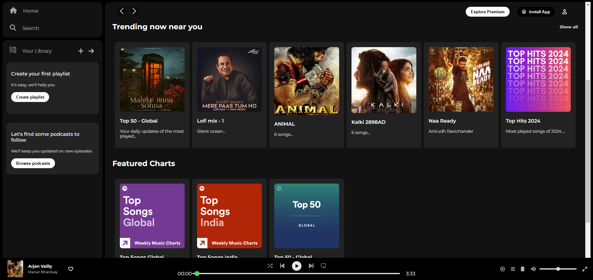

#  Spotfy-clone

A simple Spotify clone built using HTML and CSS, focusing on replicating the design. This project is purely front-end and includes no functionality.
## Live Demo

https://sepuripavan.github.io/Spotfy-clone/


## Tech Stack

- **HTML** – For structuring the webpage  
- **CSS** – For styling and responsiveness  


## Screenshot




## Run Locally

1. Clone the project

```bash
git clone https://link-to-project   
```

2. Go to the project directory

```bash
cd my-project 
```
